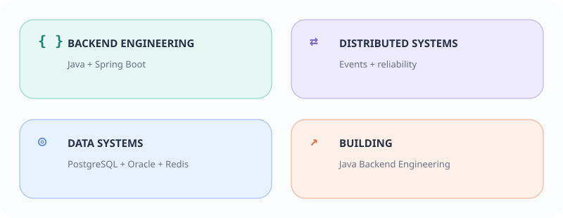
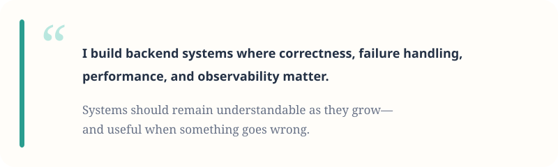
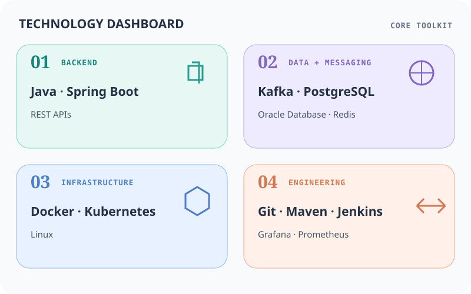
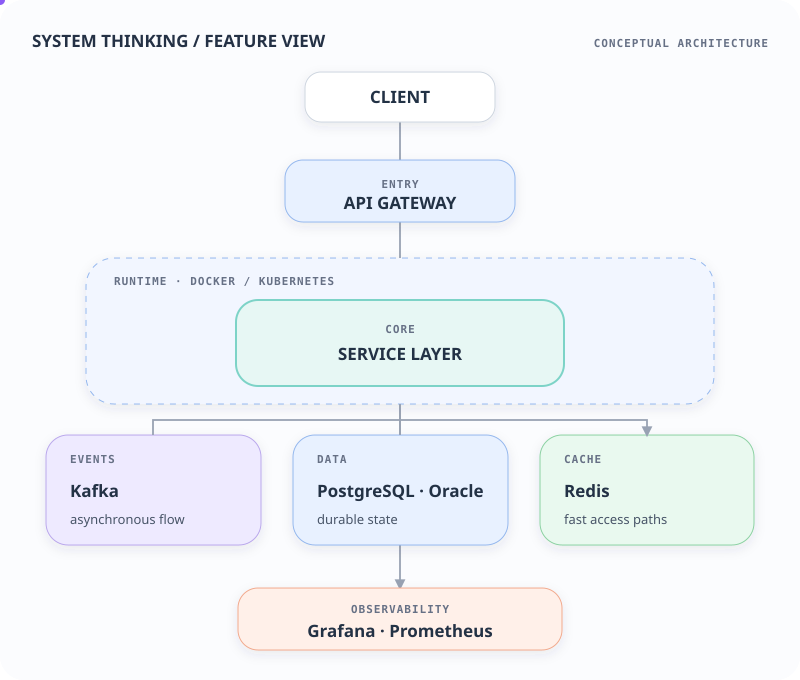
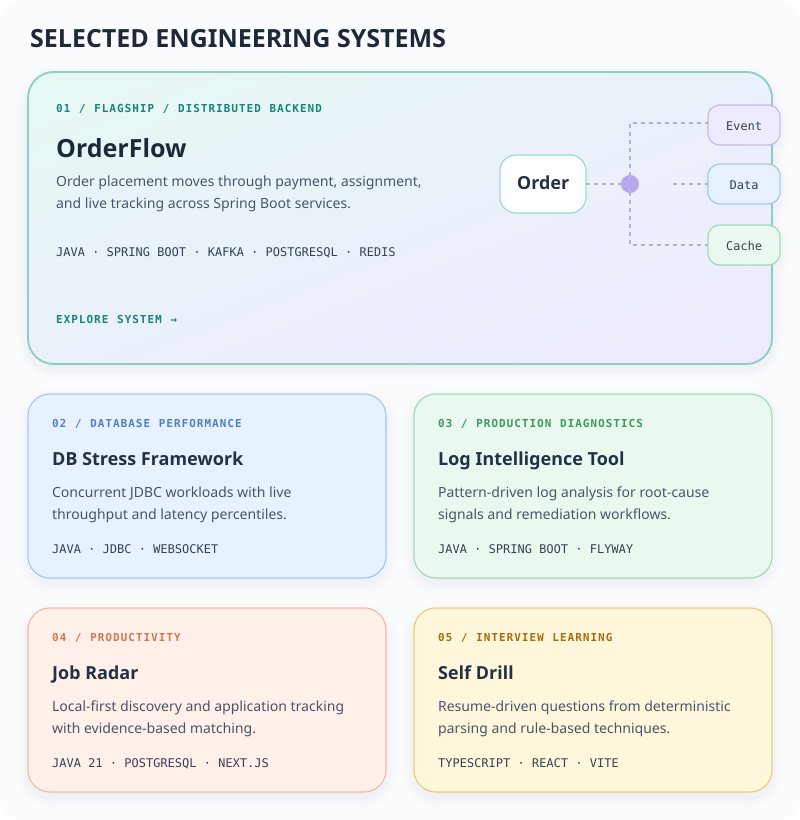
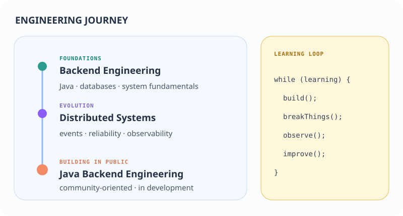
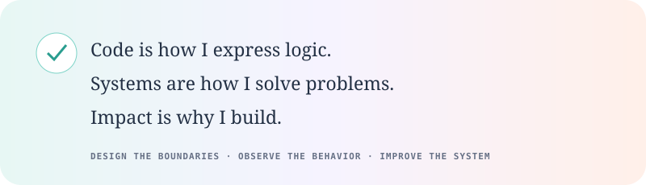

<picture>
  <source media="(prefers-color-scheme: dark)" srcset="assets/hero-dark.svg">
  <source media="(prefers-color-scheme: light)" srcset="assets/hero-light.svg">
  
</picture>

<picture>
  <source media="(prefers-color-scheme: dark)" srcset="assets/identity-dark.svg">
  <source media="(prefers-color-scheme: light)" srcset="assets/identity-light.svg">
  
</picture>

<picture>
  <source media="(prefers-color-scheme: dark)" srcset="assets/philosophy-dark.svg">
  <source media="(prefers-color-scheme: light)" srcset="assets/philosophy-light.svg">
  
</picture>

## Technology landscape

<picture>
  <source media="(prefers-color-scheme: dark)" srcset="assets/stack-dark.svg">
  <source media="(prefers-color-scheme: light)" srcset="assets/stack-light.svg">
  
</picture>

## Backend architecture

<picture>
  <source media="(prefers-color-scheme: dark)" srcset="assets/backend-architecture-dark.svg">
  <source media="(prefers-color-scheme: light)" srcset="assets/backend-architecture-light.svg">
  
</picture>

Conceptual architecture—not one literal production deployment.

## Featured systems

<picture>
  <source media="(prefers-color-scheme: dark)" srcset="assets/projects-dark.svg">
  <source media="(prefers-color-scheme: light)" srcset="assets/projects-light.svg">
  
</picture>

### [01 / OrderFlow — explore flagship system →](https://github.com/Zebaali-hub/orderflow)

Event-driven food-delivery backend spanning order placement, payment, assignment, and live tracking across Spring Boot services. `Java` `Spring Boot` `Kafka` `PostgreSQL` `Redis`

**[02 / DB Stress Framework →](https://github.com/Zebaali-hub/db-stress-framework)** · **[03 / Log Intelligence Tool →](https://github.com/Zebaali-hub/log-intelligence-tool)** 
**[04 / Job Radar →](https://github.com/Zebaali-hub/jobradar)** · **[05 / Self Drill →](https://github.com/Zebaali-hub/selfdrill)**

<picture>
  <source media="(prefers-color-scheme: dark)" srcset="assets/journey-dark.svg">
  <source media="(prefers-color-scheme: light)" srcset="assets/journey-light.svg">
  
</picture>

## Engineering activity

> **Consistent progress compounds.** Public contributions are context—not a measure of engineering ability.

<a href="https://github.com/Zebaali-hub">
  <picture>
    <source media="(prefers-color-scheme: dark)" srcset="https://github-readme-activity-graph.vercel.app/graph?username=Zebaali-hub&amp;bg_color=151827&amp;color=aeb8c8&amp;line=7dd3c7&amp;point=f2f4f7&amp;area=true&amp;area_color=173e3b&amp;hide_border=true&amp;hide_title=true&amp;radius=14&amp;days=30">
    
  </picture>
</a>

<picture>
  <source media="(prefers-color-scheme: dark)" srcset="assets/closing-dark.svg">
  <source media="(prefers-color-scheme: light)" srcset="assets/closing-light.svg">
  
</picture>

  <strong><a href="https://zebacodes.com">zebacodes.com</a></strong>&nbsp;&nbsp;·&nbsp;&nbsp;<strong><a href="https://github.com/Zebaali-hub">GitHub</a></strong>

<!-- Add LinkedIn only when a verified public URL is supplied. -->
