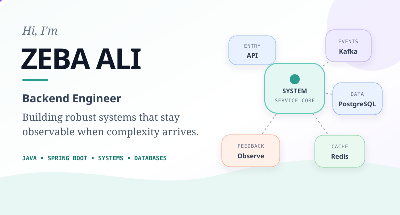
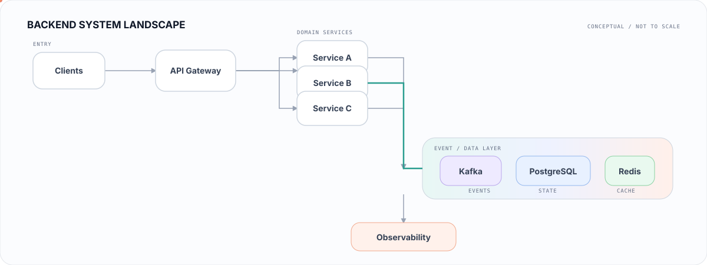

<div align="center">
  <picture>
    <source media="(prefers-color-scheme: dark) and (max-width: 600px)" srcset="assets/hero-mobile-dark.svg">
    <source media="(prefers-color-scheme: light) and (max-width: 600px)" srcset="assets/hero-mobile-light.svg">
    <source media="(prefers-color-scheme: dark)" srcset="assets/hero-dark.svg">
    <source media="(prefers-color-scheme: light)" srcset="assets/hero-light.svg">
    
  </picture>
</div>

<p align="center">
  <strong>BACKEND ENGINEERING</strong>&nbsp; · &nbsp;Distributed systems&nbsp; · &nbsp;<strong>JAVA ECOSYSTEM</strong>&nbsp; · &nbsp;Continuous builder
</p>

## Engineering, with intent

I enjoy building backend systems where correctness, failure handling, performance, and observability matter. My work spans Java backend engineering, databases, event-driven systems, and developer tooling. I care about systems that remain understandable as they grow—and useful when something goes wrong.

## Toolkit

> **LANGUAGES & BACKEND**
> &nbsp; `Java` &nbsp; `Spring Boot` &nbsp; `REST APIs`

> **DATA & MESSAGING**
> &nbsp; `Kafka` &nbsp; `PostgreSQL` &nbsp; `Oracle Database` &nbsp; `Redis`

> **INFRASTRUCTURE**
> &nbsp; `Docker` &nbsp; `Kubernetes`

> **ENGINEERING TOOLS**
> &nbsp; `Git` &nbsp; `Maven` &nbsp; `Grafana` &nbsp; `Prometheus`

## Featured systems

<table width="100%">
  <tr><td>
    <sub>01 · FLAGSHIP · DISTRIBUTED SYSTEMS</sub>
    <h3><a href="https://github.com/Zebaali-hub/orderflow">OrderFlow ↗</a></h3>
    <p>An event-driven food-delivery backend that carries an order from placement through payment, assignment, and live tracking across Spring Boot services.</p>
    <p><code>Java</code> <code>Spring Boot</code> <code>Kafka</code> <code>PostgreSQL</code> <code>Redis</code></p>
    <p><strong><a href="https://github.com/Zebaali-hub/orderflow">Explore repository →</a></strong></p>
  </td></tr>
</table>

<table width="100%">
  <tr><td>
    <sub>02 · DATABASE PERFORMANCE</sub>
    <h3><a href="https://github.com/Zebaali-hub/db-stress-framework">DB Stress Framework ↗</a></h3>
    <p>A configurable JDBC workload runner for observing concurrency, throughput, latency percentiles, error rates, and database behavior under stress.</p>
    <p><code>Java</code> <code>Spring Boot</code> <code>JDBC</code> <code>WebSocket</code> <code>PostgreSQL</code></p>
    <p><strong><a href="https://github.com/Zebaali-hub/db-stress-framework">Explore repository →</a></strong></p>
  </td></tr>
</table>

<table width="100%">
  <tr><td>
    <sub>03 · PRODUCTION DIAGNOSTICS</sub>
    <h3><a href="https://github.com/Zebaali-hub/log-intelligence-tool">Log Intelligence Tool ↗</a></h3>
    <p>A backend service that analyses Oracle, Java, PostgreSQL, AWR, and SQL Monitor logs for patterns, root-cause signals, and remediation workflows.</p>
    <p><code>Java</code> <code>Spring Boot</code> <code>PostgreSQL</code> <code>Flyway</code> <code>Docker</code></p>
    <p><strong><a href="https://github.com/Zebaali-hub/log-intelligence-tool">Explore repository →</a></strong></p>
  </td></tr>
</table>

<table width="100%">
  <tr><td>
    <sub>04 · ENGINEERING PRODUCTIVITY</sub>
    <h3><a href="https://github.com/Zebaali-hub/jobradar">Job Radar ↗</a></h3>
    <p>A local-first job discovery and application-tracking system with evidence-based matching and explicit boundaries around automation.</p>
    <p><code>Java 21</code> <code>Spring Boot</code> <code>PostgreSQL</code> <code>Next.js</code> <code>Docker</code></p>
    <p><strong><a href="https://github.com/Zebaali-hub/jobradar">Explore repository →</a></strong></p>
  </td></tr>
</table>

<table width="100%">
  <tr><td>
    <sub>05 · INTERVIEW LEARNING</sub>
    <h3><a href="https://github.com/Zebaali-hub/selfdrill">Self Drill ↗</a></h3>
    <p>A resume-driven interview practice engine that generates targeted questions through deterministic parsing and rule-based techniques.</p>
    <p><code>TypeScript</code> <code>React</code> <code>Vite</code> <code>pdf.js</code> <code>localStorage</code></p>
    <p><strong><a href="https://github.com/Zebaali-hub/selfdrill">Explore repository →</a></strong></p>
  </td></tr>
</table>

## A backend system, in one view

<picture>
  <source media="(prefers-color-scheme: dark) and (max-width: 600px)" srcset="assets/system-flow-mobile-dark.svg">
  <source media="(prefers-color-scheme: light) and (max-width: 600px)" srcset="assets/system-flow-mobile-light.svg">
  <source media="(prefers-color-scheme: dark)" srcset="assets/system-flow-dark.svg">
  <source media="(prefers-color-scheme: light)" srcset="assets/system-flow-light.svg">
  
</picture>

<sub>A visual vocabulary for the backend and distributed-system concepts I work with—not one literal production architecture.</sub>

## Currently building

> **JAVA BACKEND ENGINEERING** &nbsp; `IN DEVELOPMENT`
>
> A structured, community-oriented repository for backend engineering learning material, examples, patterns, and interview-focused explanations.

## Engineering activity

<a href="https://github.com/Zebaali-hub">
  <picture>
    <source media="(prefers-color-scheme: dark)" srcset="https://github-readme-activity-graph.vercel.app/graph?username=Zebaali-hub&amp;bg_color=0d1117&amp;color=8b949e&amp;line=7dd3c7&amp;point=e6edf3&amp;area=true&amp;area_color=134e4a&amp;hide_border=true&amp;hide_title=true&amp;radius=8&amp;days=30">
    
  </picture>
</a>

<sub>Public contributions only. Activity is context—not a measure of engineering ability.</sub>

```java
while (learning) {
    build();
    breakThings();
    observe();
    improve();
}
```

---

### Code is how I express logic. Systems are how I solve problems. Impact is why I build.

**[Portfolio — zebacodes.com](https://zebacodes.com)** &nbsp;·&nbsp; **[GitHub — Zebaali-hub](https://github.com/Zebaali-hub)**

<!-- Add LinkedIn or a professional email only when verified and intended for public indexing. -->
